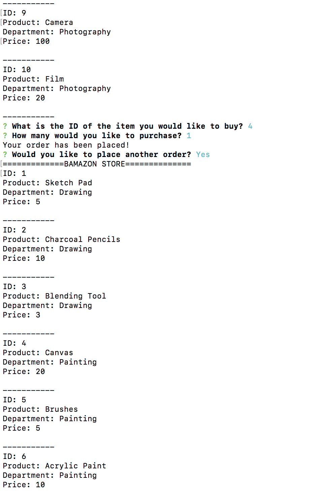

# Bamazon

This is a Node.js/mySQL app similar to Amazon. The app will take in orders from customers and change stock from the store's inventory according to the customer's purchases. 

## The App
This app requires running mySQL and installing npm dependencies as well as node modules. The user will then run the app and be immediately shown the 10 items available for sale in the Bamazon store. Next, the user is prompted with 2 questions: the ID of the item they would like to buy and how many of these items they would like to buy. Once these answers are inputed, the user will be prompted with "Your order has been placed!" and the number of items the user purchased will be deducted from the mySQL database.

Next, the user will be asked if they would like to purchase another item. If they answer no, they will be disconnected from the store. If they answer yes, they will run through the above cycle again.

This project is still a work in progress.

